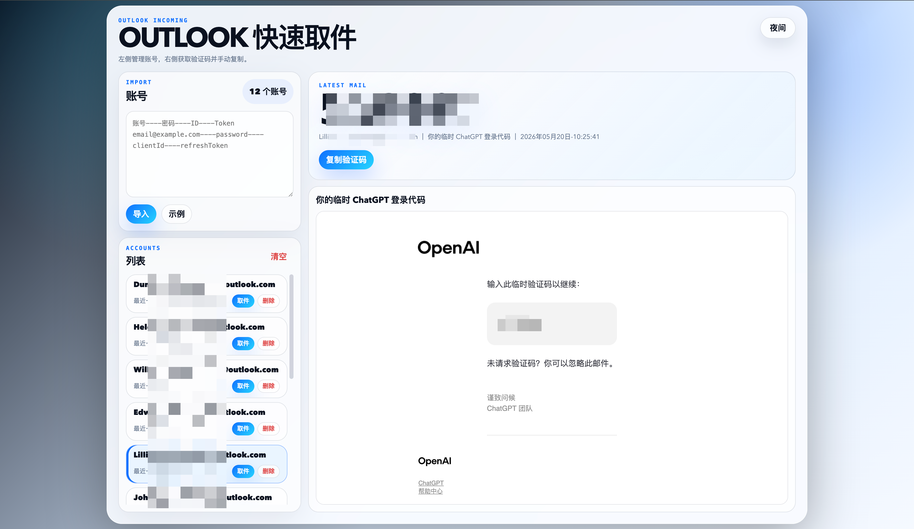

# outlook-incoming

Outlook / Hotmail 快速取件工具。项目使用静态前端 + TypeScript/Node 后端，后端通过 Microsoft Graph、IMAP XOAUTH2、Outlook REST API 获取最新邮件，并在页面中展示邮件内容和验证码。

## 示例



## 功能

- 批量导入 Outlook / Hotmail 账号信息
- 获取最新一封邮件
- 自动解析 6 位验证码
- 渲染完整邮件 HTML 内容
- 账号、token、邮件内容和最近取件结果只保存在浏览器本地 `localStorage`
- 后端只转发取件请求，不落盘保存邮箱、token、邮件内容或运行记录
- 支持白天 / 夜间主题
- 单容器部署，Node 服务同时提供页面和 API

## 技术栈

- 前端：原生 HTML / CSS / JavaScript
- 后端：TypeScript / Node.js / Express
- 邮件通道：Microsoft Graph → IMAP XOAUTH2 → Outlook REST API
- 部署：Docker Compose 单容器

## 目录结构

```text
.
├── web/                 # 静态前端
│   ├── index.html
│   ├── styles.css
│   ├── app.js
│   └── mail-utils.js
├── server/              # TypeScript / Express 后端
│   ├── src/
│   ├── package.json
│   └── tsconfig.json
├── Dockerfile           # Node 单容器镜像
├── docker-compose.yml   # 单容器部署配置
└── doc/img/image.png    # README 示例截图
```

## 本地启动

安装依赖：

```bash
npm --prefix server install
```

启动完整应用：

```bash
npm --prefix server start
```

`npm --prefix server start` 会自动构建 TypeScript，然后启动 Node 服务。

打开：

```text
http://127.0.0.1:17345
```

Node 服务会同时提供：

- 静态页面：`/`
- 前端资源：`/app.js`、`/styles.css`、`/mail-utils.js`
- API：`/api/messages`、`/api/code` 等

## Docker 启动

```bash
docker-compose up --build
```

打开：

```text
http://127.0.0.1:17345
```

Docker 模式下只有一个 `server` 服务：

- 容器内监听 `0.0.0.0:17345`
- 宿主机端口映射为 `17345:17345`
- `web/` 会被复制到容器 `/app/web`
- 容器不挂载数据目录，后端不保存邮箱、token、邮件内容或运行记录

## 账号导入格式

每行一个账号：

```text
账号----密码----ID----Token
email@example.com----password----clientId----refreshToken
```

其中：

- `账号`：Outlook / Hotmail 邮箱
- `密码`：保留字段，当前取件不依赖密码
- `ID`：OAuth client id
- `Token`：refresh token

## 常用命令

类型检查：

```bash
npm --prefix server run typecheck
```

构建：

```bash
npm --prefix server run build
```

开发模式：

```bash
npm --prefix server run dev
```

启动：

```bash
npm --prefix server start
```

构建 Docker 镜像：

```bash
docker-compose build server
```

## API

### `POST /api/messages`

获取最新邮件。

请求示例：

```json
{
  "email": "example@hotmail.com",
  "clientId": "client-id",
  "refreshToken": "refresh-token",
  "top": 1,
  "mailboxes": ["INBOX", "Junk"]
}
```

响应示例：

```json
{
  "ok": true,
  "messages": [],
  "mailboxResults": [],
  "nextRefreshToken": "",
  "tokenEndpoint": "",
  "transport": "graph"
}
```

### `POST /api/code`

获取邮件并尝试解析验证码。

## 环境变量

- `HOTMAIL_HELPER_HOST`：服务监听地址，默认 `127.0.0.1`
- `HOTMAIL_HELPER_PORT`：服务端口，默认 `17345`
- `HOTMAIL_HELPER_WEB_DIR`：静态前端目录，默认 `../web`

## 数据保存位置

账号、token、最近取件结果和邮件内容只保存在当前浏览器本地：

```text
localStorage: outlook-incoming.quick-mail.v2
```

## 说明

直接打开 `web/index.html` 或使用普通静态服务器无法完成取件，因为页面需要调用 `/api/*` 接口。请使用 `npm --prefix server start` 或 `docker-compose up --build` 启动完整应用。
